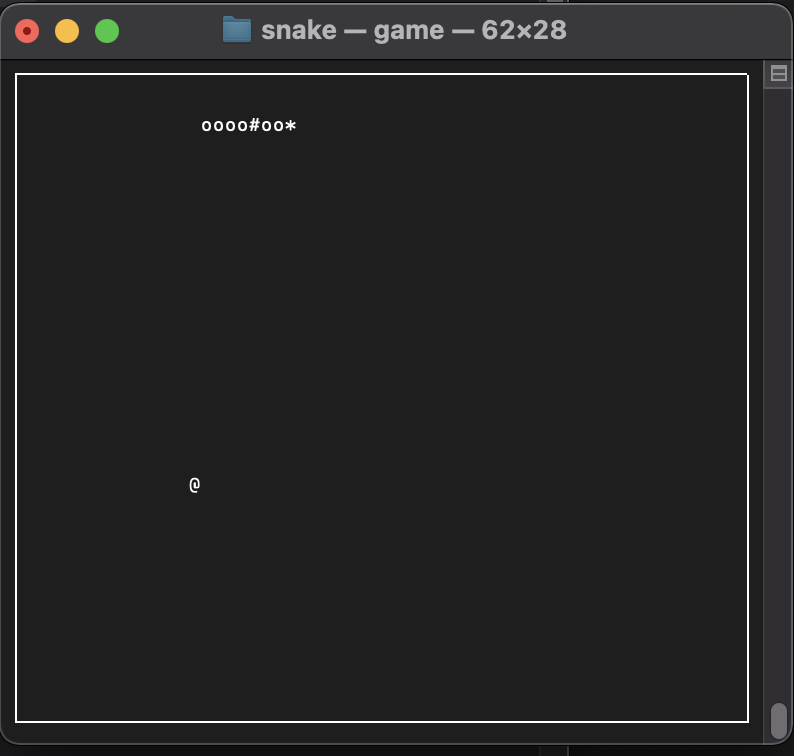
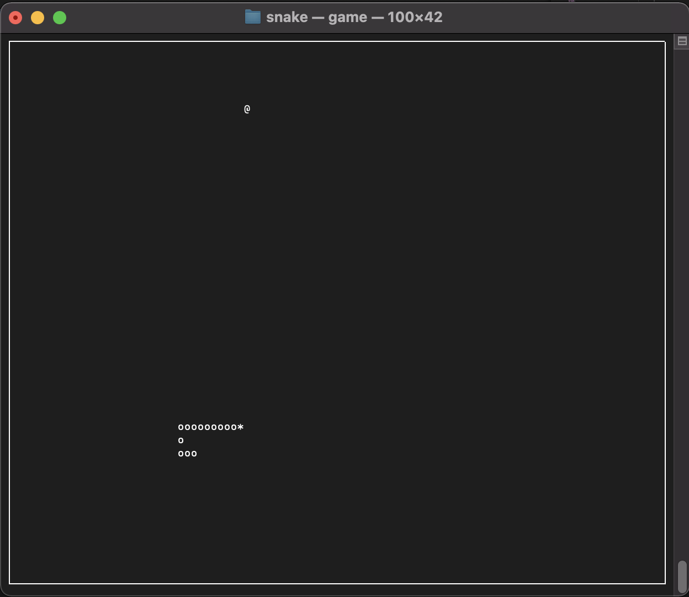
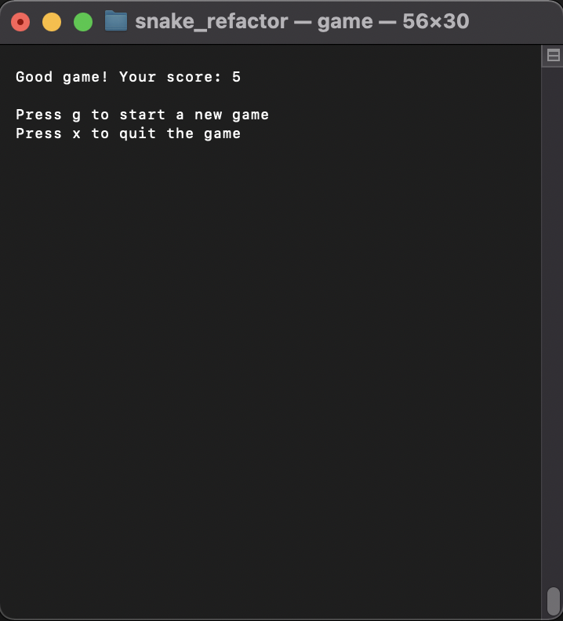

# snakeGame

console snake game written in cpp using Ncurses library

build using make commend

execute: ./game

snake head symbol: *  
snake body shape: *oooooo  
snake body shape: *oo#ooo  
#: fruit in the stomach  
fruit: @  
press x to quit the game  
Visual representation:
 

 
Current game window size changable
 
 

 
Show score after death, press 'x' the quit the program
 
Show score after death, press 'g' start a new game
 

